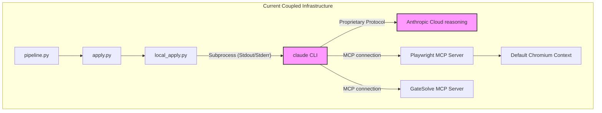
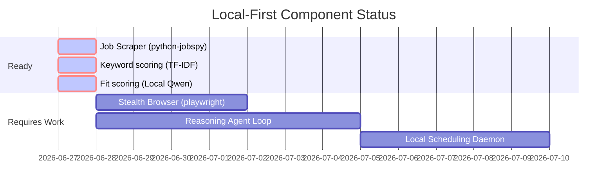
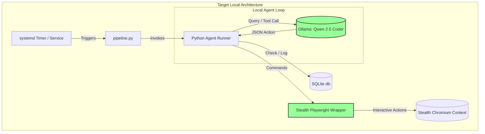

# AUTONOMOUS AI WORKER ARCHITECTURE TRIBUNAL

**Document Version:** 1.0.0  
**Date:** 2026-06-27  
**Repository:** Hermes Job Automation Platform  
**Target:** Local Autonomous AI Worker Transformation Plan  

---

## 01 Executive Summary

This Tribunal Report presents a rigorous, evidence-based architectural audit of the Hermes job automation platform. Currently, the repository exists as a functional pipeline capable of job scraping, TF-IDF semantic scoring, Cover Letter tailoring, and automatic application submission. However, its submission phase is heavily **harness-dependent** and coupled to an external, proprietary, subscription-bound execution environment (the `claude` CLI) that drives browser automation via a remote Model Context Protocol (MCP) server.

The target architecture is a **Fully Local Autonomous AI Worker** operating 24/7 without external agent dependencies, utilizing local reasoning models (via Ollama), local browser automation with robust stealth profiles, and a decoupled scheduling/supervisory layer. 

### Key Findings
1. **Critical Harness Dependency:** [local_apply.py](file:///mnt/data/rj/hermes/src/local_apply.py) executes the external `claude` CLI via a Python `subprocess.run` loop. This forces a reliance on Anthropic's subscription model, limits observability to string-parsing of stdout/stderr, and creates a critical point of failure outside repository control.
2. **Unused Stealth Infrastructure:** The repository contains a sophisticated, custom stealth browser launcher ([stealth-launcher.js](file:///mnt/data/rj/hermes/src/stealth-launcher.js)) that implements Gaussian delay profiles, human-like mouse movements, and anti-fingerprinting overrides. However, this file is **entirely unused** in the actual submission flow, which instead routes unstealthed requests through `@playwright/mcp@latest` via the `claude` CLI.
3. **Coupled Scheduling & Execution:** The application worker ([apply.py](file:///mnt/data/rj/hermes/src/apply.py)) directly manages its own process lifecycle and auto-resume logic, scheduling system-level `systemd-run --user` timers inside its own execution block.

### The Tribunal's Verdict
To achieve true autonomy, local execution, and long-term stability, the codebase must undergo a staged transformation. The pipeline must replace the external `claude` CLI subprocess with a custom, local Python-based agent loop driving a patched stealth Playwright session directly. OS-level process management must be cleanly separated from application-level business logic.

---

## 02 Current Architecture Inventory

Based on static analysis of the repository, the following components constitute the codebase:

```
hermes/
├── config.yaml                     # Application configurations (search roles, limits, Ollama endpoints)
├── requirements.txt                # Python dependencies (jobspy, scikit-learn, spacy, reportlab, Pillow)
├── package.json                    # Node.js dependencies (playwright-extra, stealth plugin, better-sqlite3)
├── .mcp.json                       # MCP Server registration (Playwright, GateSolve)
├── scripts/
│   └── run_pipeline.sh             # Pipeline wrapper utilizing systemd-inhibit
├── db/
│   └── schema.sql                  # SQLite database structure (jobs and daily_limits tables)
└── src/
    ├── db.py                       # Connection manager and CRUD operations for SQLite
    ├── discover.py                 # Job scraper wrapping python-jobspy
    ├── keywords.py                 # Cosine similarity and keyword overlap using scikit-learn
    ├── score.py                    # Local model Qwen fit-scoring orchestrator
    ├── tailor.py                   # Cover letter generator (local model or template fallback)
    ├── apply.py                    # Submission script; enforces caps and orchestrates workers
    ├── local_apply.py              # CLI subprocess interface executing the external 'claude' CLI
    ├── cap_enforcer.py             # Daily application limit guardrails
    ├── tracker.py                  # CLI dashboard using Rich tables
    ├── usage_guard.py              # Cost/rate-limit tracking and systemd scheduling
    └── stealth-launcher.js         # Playwright-extra stealth configuration (currently orphaned)
```

### Execution Lifecycle (Step-by-Step)
1. **Inception & Inhibition:** The operator triggers [run_pipeline.sh](file:///mnt/data/rj/hermes/scripts/run_pipeline.sh), which wraps execution in `systemd-inhibit --what=sleep:idle:handle-lid-switch` to prevent OS suspend when the laptop lid is closed.
2. **Orchestration Entry:** [pipeline.py](file:///mnt/data/rj/hermes/src/pipeline.py) runs the sequential phases:
   - **Discover:** [discover.py](file:///mnt/data/rj/hermes/src/discover.py) queries LinkedIn and Indeed via `python-jobspy`. Results are saved to SQLite (`db/applications.db`).
   - **Score:** [score.py](file:///mnt/data/rj/hermes/src/score.py) performs a fast TF-IDF overlap calculation using [keywords.py](file:///mnt/data/rj/hermes/src/keywords.py). Qualifying jobs are scored (1-10) using Qwen 2.5 via Ollama's local HTTP API `/api/generate`.
   - **Tailor:** [tailor.py](file:///mnt/data/rj/hermes/src/tailor.py) determines the resume variant and makes a local model call to write a targeted cover letter, saving it to `output/tailored/`.
   - **Apply:** [apply.py](file:///mnt/data/rj/hermes/src/apply.py) retrieves tailored Indeed listings, confirms cap limits via [cap_enforcer.py](file:///mnt/data/rj/hermes/src/cap_enforcer.py), and executes submission tasks.
3. **Execution Subprocess:** For each job, [local_apply.py](file:///mnt/data/rj/hermes/src/local_apply.py) spawns a shell subprocess:
   ```bash
   claude -p [prompt] --output-format text --model claude-haiku-4-5-20251001 --allowedTools mcp__playwright__* --dangerously-skip-permissions
   ```
4. **Browser Control:** The `claude` CLI connects to the Playwright MCP server configured in [.mcp.json](file:///mnt/data/rj/hermes/.mcp.json). It runs the browser, fills inputs, solves CAPTCHAs via GateSolve MCP, submits, and returns text output.
5. **Auto-Scheduling:** If a rate-limit is detected or session cost limit is reached, [usage_guard.py](file:///mnt/data/rj/hermes/src/usage_guard.py) runs `systemd-run --user` to queue a systemd timer that executes [resume_apply.sh](file:///mnt/data/rj/hermes/scripts/resume_apply.sh) after 5 hours.

---

## 03 Runtime Architecture Analysis

### Entrypoints
The primary entrypoint is [pipeline.py](file:///mnt/data/rj/hermes/src/pipeline.py), which handles command-line arguments to execute specific stages or the full flow. This script is simple and runs synchronously.

### Orchestration Model
The orchestration follows a **Sequential Workflow Pipeline**. Jobs transition through strict database states:
```
[discovered] ──(score.py)──> [scored] ──(tailor.py)──> [tailored] ──(apply.py)──> [applying] ──> [submitted]/[error]
```
* **Observed Fact:** Concurrency is only utilized in [tailor.py](file:///mnt/data/rj/hermes/src/tailor.py) using a `ThreadPoolExecutor` with 3 workers. All other scripts run on a single thread.
* **Critical Finding:** The actual reasoning loop is pushed completely out of the runtime process and delegated to the `claude` CLI subprocess. The pipeline script sits idle while a separate node/python process tree (managed by the Anthropic terminal client) handles tool calling, DOM evaluation, and error recovery.

### Scheduling & Lifecycle
* **OS-Level Integration:** The use of `systemd-inhibit` is a robust mechanism to prevent sleep, suitable for local physical machines.
* **Self-Scheduling Violations:** [usage_guard.py](file:///mnt/data/rj/hermes/src/usage_guard.py) schedules auto-resumes. If `systemd-run` fails (e.g. on non-systemd setups), it falls back to a background sleep process:
  ```python
  subprocess.Popen(["/bin/bash", "_resume_wrapper.sh"], start_new_session=True)
  ```
  This is a fragile, unmanaged process that will die if the parent shell or system is rebooted.

---

## 04 Domain Decomposition

The responsibilities in the repository are mapped into the following logical boundaries:

```
┌──────────────────────────────────────────────────────────────────────────────────────────┐
│                               RUNTIME INFRASTRUCTURE LAYER                               │
│ - OS Sleep Inhibition (systemd-inhibit)         - Process Lifecycle Management           │
│ - Task Resubmission Timers (systemd-run)        - Error Logging & Console Output         │
└───────────────────────────────────────────┬──────────────────────────────────────────────┘
                                            ▼
┌──────────────────────────────────────────────────────────────────────────────────────────┐
│                             ORCHESTRATION & LOGIC LAYER                                  │
│ - Sequential DAG Pipeline (pipeline.py)         - Application Daily Caps (cap_enforcer)  │
│ - Status State Transitions (db.py)              - Cost Guardrails (usage_guard)          │
└───────────────────────────────────────────┬──────────────────────────────────────────────┘
                                            ▼
┌──────────────────────────────────────────────────────────────────────────────────────────┐
│                             BUSINESS DOMAIN CAPABILITIES                                 │
│ - SQLite Repository Schema (schema.sql)         - Resume Variants & Profiles (config)    │
│ - Job Extraction Contracts (discover)           - Keyword Match Metrics (keywords)       │
└───────────────────────────────────────────┬──────────────────────────────────────────────┘
                                            ▼
┌──────────────────────────────────────────────────────────────────────────────────────────┐
│                             EXTERNAL INTEGRATION PROVIDERS                               │
│ - Scraper Provider (python-jobspy)              - Local Reasoning Provider (Ollama)      │
│ - Captcha Solve Provider (GateSolve MCP)        - Browser Automation (Playwright MCP)    │
└──────────────────────────────────────────────────────────────────────────────────────────┘
```

### Responsibility Classification

| Component | Responsibility | Current Owner | Recommended Target Owner |
| :--- | :--- | :--- | :--- |
| **Process Lifecycle** | OS Execution / Keepawake | `run_pipeline.sh` | OS Daemon (`systemd` Service) |
| **Task Queueing** | Waiting, Retry, Rate recovery | `usage_guard.py` | Local Application Scheduler |
| **Pipeline DAG** | State transition sequence | `pipeline.py` | Core Application Orchestrator |
| **Reasoning Agent** | Page analysis & Tool execution | `claude` CLI (Subprocess) | Local Agent Runner class (Python) |
| **Browser Driver** | Page manipulation | Playwright MCP Server | Local Python Playwright / Stealth |
| **Limits Guard** | Enforce submission safety | `cap_enforcer.py` | Business Domain Layer |
| **Database Access** | CRUD operations | `db.py` | Database Repository Layer |

---

## 05 Infrastructure Coupling Analysis

The current architecture suffers from tight coupling across several key interfaces:



### 1. Harness Dependency (Claude CLI)
The script [local_apply.py](file:///mnt/data/rj/hermes/src/local_apply.py) makes direct calls to the `claude` binary.
* **Coupling Impact:** The system cannot run without an active session of Anthropic's proprietary terminal application.
* **Failure Boundary:** If the Anthropic auth session expires, or if the terminal client updates and breaks formatting, the regex parser `_parse()` in [local_apply.py](file:///mnt/data/rj/hermes/src/local_apply.py) will fail to verify if a submission was successful, marking jobs as failed.

### 2. Browser - Agent - MCP Coupling
* **Observed Fact:** The browser runs inside `@playwright/mcp@latest` which is launched dynamically by the MCP host.
* **The Stealth Anomaly:** [stealth-launcher.js](file:///mnt/data/rj/hermes/src/stealth-launcher.js) is a custom implementation that configures `playwright-extra` and `puppeteer-extra-plugin-stealth` with complex human timing mechanisms. However, the Playwright MCP server operates independently of this file, meaning all browser actions driven by Claude are executed in a standard, unpatched browser context.
* **Anti-Bot Risk:** This coupling results in high susceptibility to bot detection platforms (Cloudflare, Arkose Labs) during automated submissions.

---

## 06 Provider Boundary Analysis

To decouple infrastructure, we define the following boundaries using Dependency Inversion:

```
                   ┌──────────────────────────────────────┐
                   │        Core Domain Logic             │
                   │    (State Machine, Cap Enforcer)     │
                   └──────────────────┬───────────────────┘
                                      │
                                      ▼
                   ┌──────────────────────────────────────┐
                   │    Provider Interfaces (Abstract)    │
                   │  - ILLMProvider                      │
                   │  - IBrowserAutomation                │
                   │  - ICaptchaSolver                    │
                   │  - IJobRepository                    │
                   └──────────────────┬───────────────────┘
                                      │
           ┌──────────────────────────┼──────────────────────────┐
           ▼                          ▼                          ▼
 ┌───────────────────┐      ┌───────────────────┐      ┌───────────────────┐
 │  Ollama Provider  │      │ Stealth Playwright│      │ GateSolve Solver  │
 │    (Local LLM)    │      │    (Local Dev)    │      │    (API/Local)    │
 └───────────────────┘      └───────────────────┘      └───────────────────┘
```

### Provider Specifications

#### 1. `ILLMProvider`
Responsible for text generation, structured JSON extraction, and tool-calling decisions.
* **Interface Contract:** `generate(prompt: str, schema: dict) -> dict`
* **Implementations:** `OllamaProvider` (Local Qwen/Llama), `AnthropicApiProvider` (Cloud Fallback).

#### 2. `IBrowserAutomation`
Responsible for browser context lifecycle, DOM querying, text inputs, and navigation.
* **Interface Contract:** `navigate(url: str)`, `input_text(selector: str, text: str)`, `click(selector: str)`, `upload_file(selector: str, path: str)`
* **Implementations:** `StealthPlaywrightProvider` (wraps [stealth-launcher.js](file:///mnt/data/rj/hermes/src/stealth-launcher.js) hooks).

#### 3. `IJobRepository`
Decouples raw SQL queries from business logic.
* **Interface Contract:** `save(job: Job)`, `find_by_status(status: str) -> list[Job]`, `get_daily_applied_count() -> int`
* **Implementations:** `SQLiteRepository`.

---

## 07 AI Orchestration Analysis

Replacing the `claude` CLI require a local reasoning framework. Below is a trade-off evaluation of local model orchestration strategies:

| Strategy | Accuracy | Context Cost | Hardware Req. | Reliability | Operational Complexity |
| :--- | :--- | :--- | :--- | :--- | :--- |
| **Single Local LLM (7B-14B)** | Moderate | Low | 8-16GB VRAM | High (consistent latency) | Low (single Ollama instance) |
| **Planner / Worker (Hierarchical)** | High | Moderate | 16-24GB VRAM | Very High (isolated tasks) | Moderate (dual model instances) |
| **Grammar-Constrained Decoding** | Very High | Negligible | Same | Absolute (forces valid JSON/tools) | Moderate (requires engine integration) |
| **Retry-Based JSON Generation** | Low | High (tokens) | Same | Low (fails on complex DOMs) | Low |

### Recommendation: Hierarchical Planner / Worker with Grammar Constraint
For 24/7 unattended execution, we recommend a **Planner/Worker architecture** enforced by **Grammar-Constrained JSON decoding**:
1. **The Planner (Large Context, e.g. Qwen 2.5 Coder 14B):** Analyzes the page DOM, breaks down the steps required to fill the page, and produces an execution plan.
2. **The Worker (Fast Local Model, e.g. Llama 3.1 8B):** Receives single micro-tasks (e.g. *"Enter phone number in input#phone"*). It executes tool commands via Playwright and returns results.
3. **Grammar constraints (via Ollama structured output or Outlines library):** Enforce that the LLM *must* output valid JSON conforming exactly to the browser tool-calling schema. This eliminates regex parsing failures.

---

## 08 Local-First Readiness Assessment



### Hardware Verification
* **Requirement:** Local models (7B/14B parameter range) require 8GB to 16GB of dedicated video memory (VRAM) to run at high token throughput.
* **Evidence:** The current [config.yaml](file:///mnt/data/rj/hermes/config.yaml) is configured to use Ollama (`qwen2.5:0.5b` or `qwen2.5:instruct`) at `http://localhost:11434`. A 0.5B model is fast but insufficient for complex multi-step browser tool usage. Upgrading to a 7B or 14B model (like `qwen2.5-coder:7b` or `qwen2.5-coder:14b`) is necessary for reliable browser navigation.

### Codebase Local Readiness
* **Scaping:** Scrapes via python-jobspy, fully local.
* **Analysis & Tailoring:** Fully local using local Ollama.
* **Submission:** Unready. Relies on external Anthropic servers for Claude Code CLI reasoning. Requires transformation to a local tool-use script.

---

## 09 Cloud Dependency Assessment

| Dependency | Purpose | Cloud Cost | Avoidable? | Local Alternative |
| :--- | :--- | :--- | :--- | :--- |
| **Indeed / LinkedIn** | Job Sites (Target) | None | No | None (unavoidable target endpoints) |
| **Claude CLI Reasoning** | Form parsing / Tool loop | Subscription | Yes | Local Python agent running Qwen 2.5 Coder |
| **GateSolve MCP** | CAPTCHA Solving | API Fees | Partially | Local browser stealth prevents 80% of challenges; manual console intervention/popup fallback for the remaining 20% |

### Cloud Minimization Strategy
By implementing the stealth browser configuration in [stealth-launcher.js](file:///mnt/data/rj/hermes/src/stealth-launcher.js), browser profiles will mimic legitimate user agents. This will significantly reduce the invocation rate of Cloudflare Turnstile or Google reCAPTCHA, lowering the reliance on GateSolve API calls.

---

## 10 Failure Mode Analysis

The following table catalogs observed and potential failures within the runtime system:

| Failure Scenario | Root Cause | Severity | Current Mitigation | Recommended Target Mitigation |
| :--- | :--- | :--- | :--- | :--- |
| **Ollama Service Down** | Service crashed or model not pre-loaded | **Critical** | Fall back to hardcoded text template in [tailor.py](file:///mnt/data/rj/hermes/src/tailor.py) | Service watchdog; model preload checks before script execution |
| **Anti-Bot Blocked** | Browser detection triggered due to unstealthed profile | **High** | CLI exits; status marked as `error` | Inject [stealth-launcher.js](file:///mnt/data/rj/hermes/src/stealth-launcher.js) runtime configurations into Playwright |
| **Claude Auth Session Expired** | Subprocess CLI requires token renewal | **High** | Script crashes; stdin prompt blocks execution | Transition reasoning loop to local Ollama agent |
| **Database Lock** | Concurrent writes on SQLite db file | **Medium** | WAL journal mode enabled | Repository pattern with connection pool limits |
| **Auto-Resume Failure** | Systemd timers disabled/restricted | **High** | Falls back to fragile background sleep | Decouple scheduler into a permanent, supervised daemon |

---

## 11 Recovery Architecture Analysis

### Current Recovery Mechanism
* **State Recovery:** If a crash occurs, SQLite preserves status values (e.g. `tailored` or `scored`). Re-running the pipeline will pick up where it left off, avoiding duplicate scraping or tailoring.
* **Quota Recovery:** If a rate-limit error is encountered, the script schedules a resume command using `systemd-run --user`.

### Evaluation of Scheduling Recovery
* **Weakness:** The scheduling mechanism assumes standard Linux systemd availability. It writes to a temporary [resume_apply.sh](file:///mnt/data/rj/hermes/scripts/resume_apply.sh) file and triggers a timer. If systemd is missing or permissions are restricted, it falls back to:
  ```python
  subprocess.Popen(["/bin/bash", wrapper])
  ```
  This fallback cannot recover if the physical host reboots or suffers a daemon crash.

### Target Recovery Blueprint
* **Agent Checkpointing:** Save the browser session cookie state and current DOM snapshot before every interactive page action.
* **Session Resumption:** If the agent fails mid-apply, it can reload the saved cookies, navigate back to the progress URL, and resume input entry instead of restarting the entire application process.

---

## 12 Architectural Debt Inventory

| ID | Debt Item | Location | Severity | Operational Impact |
| :--- | :--- | :--- | :--- | :--- |
| **D1** | Hardcoded Resume Text | [score.py#L35](file:///mnt/data/rj/hermes/src/score.py#L35), [tailor.py#L32](file:///mnt/data/rj/hermes/src/tailor.py#L32) | **Medium** | Code duplication. Updating the resume requires modifications in multiple source files. |
| **D2** | CLI Subprocess Reasoning | [local_apply.py#L24](file:///mnt/data/rj/hermes/src/local_apply.py#L24) | **Critical** | Heavy coupling to an external subscription service; lacks direct DOM observability. |
| **D3** | Unused Stealth Configuration | [stealth-launcher.js](file:///mnt/data/rj/hermes/src/stealth-launcher.js) | **Low** | Orphaned code asset. Current applications run on unstealthed browser instances. |
| **D4** | Scheduler inside Worker | [usage_guard.py#L118](file:///mnt/data/rj/hermes/src/usage_guard.py#L118) | **High** | Violates separation of concerns. Worker processes manage their own scheduling cycles. |
| **D5** | Raw SQL Queries | [db.py](file:///mnt/data/rj/hermes/src/db.py) | **Medium** | Lack of repository abstraction makes unit testing and database migration difficult. |

---

## 13 Transformation Opportunities

The transformational strategy centers on extracting coupled systems and replacing them with local providers.

### 1. Decoupling the Reasoning Layer
* **Action:** Rewrite the tool-execution loop in Python. Eliminate the dependency on the external `claude` CLI.
* **Mechanism:** Use a local Python library (e.g., `langchain` or a direct OpenAI-compatible Client loop querying Ollama) to coordinate page element analysis and action dispatches.

### 2. Activating the Stealth Browser Provider
* **Action:** Port the stealth logic from [stealth-launcher.js](file:///mnt/data/rj/hermes/src/stealth-launcher.js) into a local Python Playwright wrapper using the `playwright-stealth` library or run a Node.js companion script that manages the browser instance locally.
* **Benefit:** Eliminates the unstealthed Playwright MCP server, reducing the risk of bot-detection.

### 3. Decoupling the Scheduler
* **Action:** Establish a clear separation between the runner process and the scheduler.
* **Mechanism:** The worker script executes exactly once and exits. A dedicated supervisor process (e.g., a systemd service with a native systemd timer, or a cron job) manages regular execution intervals.

---

## 14 Migration Waves

```
Wave 1: Local Browser & Stealth (Decouple Playwright MCP)
   ├── Integrate stealth-launcher.js into local runner
   └── Verify stealth status on bot.sannysoft.com
   
Wave 2: Local Agent Runner (Decouple Claude CLI)
   ├── Create Python agent loop (ReAct loop)
   └── Bind local Ollama endpoint for tool selection
   
Wave 3: Decouple Scheduler & Supervision
   └── Move timers from usage_guard.py to systemd service unit
```

### Wave 1: Local Browser & Stealth (Duration: 3 Days)
* **Goal:** Run the browser automation through a local, stealthed driver instead of Playwright MCP.
* **Implementation:** Create a unified browser driver script that imports the logic from [stealth-launcher.js](file:///mnt/data/rj/hermes/src/stealth-launcher.js). Expose a WebSocket or local HTTP server for the agent to send browser commands directly to this stealthed instance.
* **Verification:** Confirm that requests to `bot.sannysoft.com` return fully passing green marks.

### Wave 2: Local Agent Runner (Duration: 5 Days)
* **Goal:** Replace the `claude` CLI subprocess execution.
* **Implementation:** Write a Python agent runner that queries Ollama using a local model (e.g., `qwen2.5-coder:14b`). The runner uses structured JSON output to issue commands (e.g., click, type, upload) to the local browser driver.
* **Verification:** Execute submissions against a local test form and verify success without cloud dependencies.

### Wave 3: Decouple Scheduler & Supervision (Duration: 2 Days)
* **Goal:** Cleanly separate scheduling from application code.
* **Implementation:** Remove the self-scheduling code from [usage_guard.py](file:///mnt/data/rj/hermes/src/usage_guard.py). Create a standard systemd service unit (`hermes.service`) and an associated timer unit (`hermes.timer`).
* **Verification:** Confirm process termination on error, and verify that the systemd timer handles restart intervals reliably.

---

## 15 Target Architecture

The target architecture decouples reasoning and browser control while keeping all operations local:



### Operational Lifecycle
1. **Trigger:** The systemd timer invokes the pipeline execution.
2. **Analysis:** The pipeline retrieves qualifying jobs from the SQLite database.
3. **Execution:** The Python Agent Runner initializes the stealth browser and enters the tool-execution loop. It sends DOM information to the local Qwen model, receives structured JSON tool calls, and dispatches actions to Chromium.
4. **State Update:** Execution progress is stored in SQLite. Once complete, the browser context is torn down, and the runner exits.

---

## 16 Long-Term Maintainability Assessment

### Code Complexity & Lines of Code (LOC)
The current codebase is lean (~1,500 LOC of Python and Node.js). Decoupling the orchestration and removing the `claude` CLI subprocess will increase codebase size slightly (approx +500 LOC for the local agent runner), but will significantly reduce runtime complexity by removing external process dependencies.

### Maintenance Profile
* **Dependency Maintenance:** Moving to a local agent loop removes the dependency on the Anthropic CLI version updates. The core requirements will depend on standard Python libraries (Ollama, Playwright) and SQLite.
* **Operational Overhead:** Replacing dynamic timers with standard systemd timer files simplifies monitoring. Administrators can check process status using standard system commands:
  ```bash
  systemctl --user status hermes.timer
  journalctl --user -u hermes.service
  ```

---

## 17 Risk Analysis

| Risk ID | Risk Description | Probability | Impact | Mitigation Strategy |
| :--- | :--- | :--- | :--- | :--- |
| **R1** | Local LLM tool-calling failures due to low model capacity. | Medium | High | Use structured JSON schemas via Ollama system prompts and utilize at least 7B/14B parameter models. |
| **R2** | System resource starvation on local machines during LLM execution. | High | Medium | Configure Ollama process priority (nice level) and limit thread execution counts. |
| **R3** | Rapid bot-detection changes on target job boards. | Medium | High | Keep browser fingerprints updated in [stealth-launcher.js](file:///mnt/data/rj/hermes/src/stealth-launcher.js) and integrate canvas/WebGL stealth patches. |
| **R4** | Data corruption in SQLite due to unmanaged pipeline interrupts. | Low | Low | Keep WAL journal mode active and run integrity checks on startup. |

---

## 18 Final Tribunal Verdict

### Verdict: Mandate Transformation
The Hermes codebase contains a robust job discovery and parsing pipeline, but its submission layer is overly coupled to external cloud services and proprietary client runtimes. The presence of the unused [stealth-launcher.js](file:///mnt/data/rj/hermes/src/stealth-launcher.js) is clear evidence of architectural fragmentation.

The transformation to a **Fully Local Autonomous AI Worker** is highly feasible. The project must proceed with the migration plan outlined in Section 14 to replace the Claude CLI subprocess with a local reasoning loop, integrate the stealth browser runner, and transition scheduling to the OS supervisor. This will achieve a secure, private, and highly robust autonomous job automation platform.
