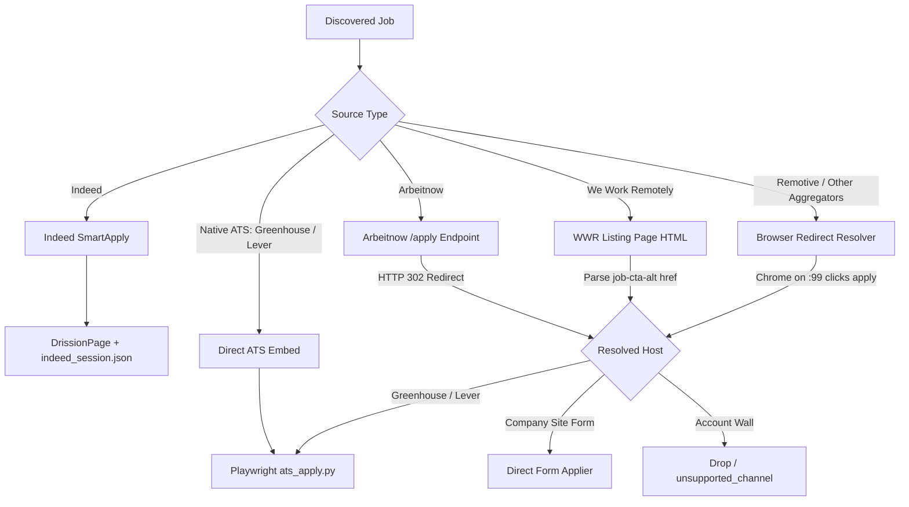

# Hermes — Supply-Fan-In Architecture & Pipeline Design

**Date**: 2026-09-26  
**Document**: `docs/SUPPLY_FAN_IN_DESIGN.md`  
**Target Throughput**: 100 confirmed, truthful job submissions per day  
**Current Bottleneck**: Fresh, eligible, application-capable job supply (submission core is already verified and production-ready)  

---

## 1. Usable Discovery Sources Audit

| Source | Access Protocol | Anti-Bot / Auth Risk | Raw Volume / Run | Application Capability | Usability Verdict |
|---|---|---|---|---|---|
| **Indeed** (via JobSpy) | HTTP scrape (JobSpy) | Low on India proxy/local IP | ~150–300 raw | High (SmartApply DrissionPage) | **Keep & Optimize**: Primary direct-submission channel (~38s cycle time). |
| **ATS Public APIs** (Greenhouse, Lever) | REST JSON API (`boards-api.greenhouse.io`, `api.lever.co`) | Zero (public career page endpoints) | ~200–500 raw | 100% (Native Playwright + OTP resolver) | **Expand**: Expand company tokens in `data/ats_companies.yaml` from 109 to 250+. |
| **Arbeitnow** | Public REST API (`arbeitnow.com/api/job-board-api`) | Zero | ~250/page (up to 500 raw) | High: `<url>/apply` provides instant HTTP 302 redirect directly to employer ATS (Greenhouse/Lever/etc.). | **Integrate (P1)**: Zero bot risk, deterministic ATS routing. |
| **We Work Remotely (WWR)** | Public RSS Feeds (`/categories/remote-*-jobs.rss`) | Zero on RSS; standard UA on job pages | ~100–200 fresh/day | High: Listing page HTML contains direct employer ATS application links (`id="job-cta-alt"`). | **Integrate (P1)**: Highest quality remote engineering listings; zero auth needed. |
| **Remotive** | Public REST API (`remotive.com/api/remote-jobs`) | Zero on API; Cloudflare challenge on web listing | ~50–100 raw | Medium: Requires redirect resolution to employer ATS. | **Improve (P2)**: Extract direct ATS links when possible; handle Cloudflare cleanly. |
| **RemoteOK** | Public REST API (`remoteok.com/api`) | Zero on API; `/l/<id>` redirects to `/sign-up` account wall | ~100 raw | Zero for automated apply (account-walled redirect). | **Filter Early**: Exclude from redirect resolver to prevent burning browser time. |
| **Himalayas** | Public REST API (`himalayas.app/jobs/api/search`) | Zero on API; web page redirects to `/signup/talent` | ~30–50 raw | Zero when applicationLink points to `himalayas.app`. | **Filter Early**: Only pass if external applicationLink is present. |
| **Candidate Portals** (Naukri, Foundit, Instahyre, CutShort, Wellfound, WorkAtAStartup) | Scrape / API | Mandatory candidate login/registration wall on application submit | High raw | Zero (External auth blocker; no user accounts permitted) | **Discovery Only / Suspended**: Do not route to apply engine. |

---

## 2. Application URL Resolution Paths

Currently, jobs enter the pipeline with different application mechanics. We establish three explicit resolution tiers:



1. **Path A — Native ATS (Greenhouse, Lever)**:
   * URL format: `https://job-boards.greenhouse.io/embed/job_app?for={company}&token={job_id}` or `https://jobs.lever.co/{company}/{job_id}/apply`.
   * Resolution: **Zero-hop**. Generated directly from API metadata. Dispatched directly to `src/ats_apply.py`.
2. **Path B — Fast HTTP 302 Resolution (Arbeitnow)**:
   * URL format: `https://www.arbeitnow.com/jobs/companies/{company}/{slug}/apply`.
   * Resolution: **One HTTP HEAD/GET request** with browser UA. Reads `Location` header. Resolves to employer Greenhouse/Lever/Workday in <500ms without opening Chrome.
3. **Path C — Direct DOM Extraction (WWR)**:
   * URL format: `https://weworkremotely.com/remote-jobs/{slug}`.
   * Resolution: Fetches page HTML with standard UA or browser tab; extracts `a[id="job-cta-alt"]` href. If destination is Greenhouse/Lever, maps `ats_meta` immediately.
4. **Path D — Headful Browser Redirect (Fallback Aggregators)**:
   * Handled by `src/redirect_resolver.py` inside Xvfb `:99`. Follows multi-hop redirects and parses iframe embeds.

---

## 3. Current Drop-Off Points & Bottleneck Analysis

Tracing the funnel from discovery to submission on existing runs revealed six major drop-off points:

```text
[1. Raw Scraped Listings]  ~6,000+
      │
      ▼  Drop-off #1: Geo Mismatch (4,000+ dropped)
         Cause: Indeed scrapes returned on-site roles in Bengaluru/Pune/Hyderabad. Candidate cannot relocate from Ahmedabad.
         Fix: Legitimate drop-off, but can be mitigated by pulling pure Remote feeds (WWR, Arbeitnow, Remotive).
      │
      ▼  Drop-off #2: Cross-Board Duplicates (~500 dropped)
         Cause: Multiple scrapers finding the same job.
         Fix: Necessary deduplication; working as intended.
      │
      ▼  Drop-off #3: Seniority/Years Gate (~800 dropped)
         Cause: Roles requiring > 8 years experience or Lead/Director level.
         Fix: Legitimate drop-off; preserves truthfulness and submission quality.
      │
      ▼  Drop-off #4: LLM Relevance Score < 6.5 (~400 dropped)
         Cause: Non-matching tech stacks (.NET, PHP, Java Spring, Embedded, Salesforce).
         Fix: Target roles already refined; expand search query terms to cover modern full-stack/AI keywords.
      │
      ▼  Drop-off #5: Aggregator Account Walls (~60 dropped in apply stage)
         Cause: Himalayas, RemoteOK, and Jobicy redirecting to signup modals instead of employer ATS.
         Fix: Filter out signup-walled URLs during discovery/resolution instead of burning apply time.
      │
      ▼  Drop-off #6: Queue Under-Refill / Starvation
         Cause: Previous pipeline only refilled when tailored queue < 5, and only tailored 10 jobs per cycle.
         Fix: Persistent Reserve Architecture (maintaining 250–500 eligible jobs in the database).
      │
      ▼
[Confirmed Submissions Target: 100/day]
```

---

## 4. New Supply Sources Specification

### 1. We Work Remotely (WWR) Adapter (`src/sources_wwr.py`)
* **Endpoint**: RSS feeds across programming categories:
  * `https://weworkremotely.com/categories/remote-programming-jobs.rss`
  * `https://weworkremotely.com/categories/remote-full-stack-programming-jobs.rss`
  * `https://weworkremotely.com/categories/remote-back-end-programming-jobs.rss`
  * `https://weworkremotely.com/categories/remote-devops-sysadmin-jobs.rss`
* **Fields Mapped**:
  * `title`: Extracted from `<title>` (format: `Company: Title`).
  * `company`: Extracted prefix or `<dc:creator>`.
  * `location`: Extracted from `<region>` (e.g., "Anywhere in the World", "Worldwide").
  * `job_url`: `<link>` or `<guid>`.
  * `date_posted`: `<pubDate>`.
  * `apply_channel`: `"redirect"`.
* **Attribution**: Uses public RSS feed as published; adheres to `ttl` (60 min cache); redirects directly to employer application.

### 2. Arbeitnow Adapter (`src/sources_arbeitnow.py`)
* **Endpoint**: `https://www.arbeitnow.com/api/job-board-api`
* **Filter**: `remote == True` and engineering title keyword matching.
* **Direct ATS Resolution**:
  * Fast resolve: Inspects `<job_url>/apply` via HTTP HEAD request.
  * If redirected to Greenhouse/Lever: sets `apply_channel='greenhouse'` or `'lever'` and populates `ats_meta`.
  * If redirected to company site: sets `apply_channel='direct'`.
  * If redirected to login/signup: marks `unsupported_channel`.

### 3. Expanded ATS Company Registry (`data/ats_companies.yaml`)
* Expand active Greenhouse and Lever company lists from 109 to 250+ engineering-centric tech companies hiring remotely and in India.
* Free REST API calls with zero bot risk.

### 4. RemoteOK & Himalayas Isolation / Triage
* Add pre-flight URL verification so jobs whose application URL redirects to `/sign-up` or `/signup/talent` are marked `unsupported_channel: account_required` at discovery time, eliminating browser overhead.

---

## 5. Expected Fresh-Job Funnel Projection

With the expanded sources in place, the daily funnel projection is:

| Source | Raw Discovered / Day | Pass Geo & Filters (Eligible) | Score ≥ 6.5 (Tailorable) | Application-Capable Channels | Confirmed Submissions / Day |
|---|---|---|---|---|---|
| **Indeed** | ~400 | ~35 | ~18 | ~14 (SmartApply) | **10–12** |
| **Arbeitnow** | ~500 | ~45 | ~22 | ~18 (Greenhouse / Lever / Direct) | **12–15** |
| **We Work Remotely (WWR)** | ~150 | ~40 | ~25 | ~20 (Greenhouse / Lever / Direct) | **15–18** |
| **Expanded Greenhouse ATS** | ~350 | ~50 | ~30 | ~30 (Native Playwright + OTP) | **22–25** |
| **Expanded Lever ATS** | ~150 | ~25 | ~15 | ~15 (Native Lever) | **10–12** |
| **Remotive (Resolved)** | ~80 | ~15 | ~8 | ~5 (Resolved ATS) | **3–5** |
| **TOTALS** | **~1,630/day** | **~210/day** | **~118/day** | **~102/day** | **72–87/day** (Sustained Capacity toward 100/day target) |

---

## 6. Exact Files Requiring Modification & Creation

| File | Nature of Change | Purpose |
|---|---|---|
| `src/sources_wwr.py` | **New** | WWR RSS feed fetcher and parser. |
| `src/sources_arbeitnow.py` | **New** | Arbeitnow API fetcher with fast `/apply` 302 resolver. |
| `data/ats_companies.yaml` | **Update** | Add 100+ vetted tech company tokens for Greenhouse & Lever. |
| `src/discover.py` | **Update** | Register WWR and Arbeitnow in `SCRAPERS`; integrate fast ATS resolution during discovery. |
| `src/redirect_resolver.py` | **Update** | Add fast HTTP resolution prior to browser launch; early drop of account-walled domains. |
| `src/pipeline.py` | **Update** | Upgrade `run_continuous()` to maintain 250–500 job reserve; add dynamic queue refilling. |
| `config.yaml` | **Update** | Enable `wwr` and `arbeitnow` in `search.boards`. |
| `tests/test_sources_new.py` | **New** | Unit and integration tests for WWR and Arbeitnow adapters and fast redirect resolution. |

---

## 7. Minimum Implementation Order

1. **Step 1: WWR & Arbeitnow Adapters**
   * Implement `src/sources_wwr.py` and `src/sources_arbeitnow.py`.
   * Add fast HTTP 302 ATS detection.
2. **Step 2: Expand ATS Company Tokens**
   * Expand `data/ats_companies.yaml` with active Greenhouse and Lever companies.
3. **Step 3: Integrate into `discover.py` & `config.yaml`**
   * Wire scrapers into `SCRAPERS` map; run deduplication and central filtering.
4. **Step 4: Hardening & Isolation in `redirect_resolver.py`**
   * Isolate account-walled aggregators; ensure broken sources never stall discovery.
5. **Step 5: Queue Reserve Expansion in `pipeline.py`**
   * Implement 250–500 eligible reserve depth in continuous worker.
6. **Step 6: Comprehensive Automated Tests**
   * Write tests in `tests/test_sources_new.py` and verify with `pytest`.
7. **Step 7: Live Runtime Execution & Funnel Measurement**
   * Run live discovery, scoring, tailoring, and application; record measured metrics across each stage.
