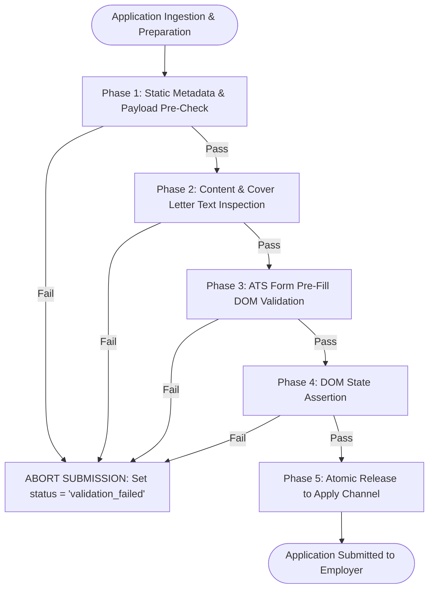

# Report 4: Pre-Submission Validation Gate Specification

**Document ID:** HERMES-GATE-SPEC-04  
**Target System:** Hermes Automated Application Pipeline  
**Design Scope:** Pre-Submission Validation Gate (PSVG) — Final validation barrier before external form submission.  
**Operational Constraint:** Validation logic only; no architectural redesign, no alteration of the core application flow.  
**Evidence Hierarchy:**
1. Authoritative Resume PDF ([resumes/resume-backend.pdf](file:///mnt/data/rj/hermes/resumes/resume-backend.pdf))
2. Verified Indeed Profile Data
3. Production Database Records ([db/applications.db](file:///mnt/data/rj/hermes/db/applications.db))
4. Current Config Files ([config.yaml](file:///mnt/data/rj/hermes/config.yaml), [profile/facts.md](file:///mnt/data/rj/hermes/profile/facts.md), [profile/resume.yaml](file:///mnt/data/rj/hermes/profile/resume.yaml))
5. Generated Cover Letters ([output/tailored/](file:///mnt/data/rj/hermes/output/tailored/))
6. Tests ([tests/test_truthfulness.py](file:///mnt/data/rj/hermes/tests/test_truthfulness.py), [tests/test_adversarial.py](file:///mnt/data/rj/hermes/tests/test_adversarial.py))
7. Historical Planning Documents ([agent-build-plan.md](file:///mnt/data/rj/hermes/agent-build-plan.md))

---

## Executive Summary

Candidate-facing identity corruption and factual drift have reached 51 live submitted employer applications (68.9% of all production submissions). To permanently eliminate this failure mode without redesigning Hermes or altering its existing execution pipeline, an impermeable **Pre-Submission Validation Gate (PSVG)** is specified.

The PSVG acts as an atomic, zero-tolerance gatekeeper positioned immediately prior to external network dispatch or form submission. If an application payload fails any fatal validation rule, the submission process aborts instantaneously, the application is transitioned to `status = 'validation_failed'`, an audit failure log is committed, and no bytes or form fields reach the employer.

---

## SECTION A — Validation Categories

The Pre-Submission Validation Gate evaluates candidate materials across seven discrete categories:

1. **Identity Validation:** Asserts that candidate contact information (Name, Phone, Email, Location) matches authoritative ground truth with 100% exactitude.
2. **Truthfulness Validation:** Enforces strict alignment with verified candidate capabilities, barring fabricated years of experience, unearned leadership titles, unsupported degrees, and unauthorized skill claims.
3. **Placeholder Detection:** Scans all text payloads for unparsed template syntax, brackets, curly braces, and boilerplate markers.
4. **Company Detection:** Verifies that target employer names are concrete, known, and resolved organizations, barring placeholders or `"Unknown"`.
5. **Salary Validation:** Validates expected compensation and CTC answers against configured currency and monthly/annual floors, rejecting unparseable prose on numeric inputs.
6. **Link Validation:** Validates that candidate URLs (LinkedIn, GitHub, Portfolio) are syntactically valid, accessible, and point to verified profiles.
7. **Completeness Validation:** Verifies structural requirements of application packages (resume PDF presence, non-zero file sizes, minimum/maximum text lengths).

---

## SECTION B — Granular Validation Rules

### 1. Identity Validation

| Rule ID | Rule Name | Failure Condition | Severity | Blocking Status |
|---|---|---|---|---|
| **VAL-ID-01** | **Phone Number Exact Match** | Payload phone number clean digits != `9106990136` (e.g. contains transposed `9016990136` or missing country code). | **CRITICAL** | **BLOCKING (FATAL)** |
| **VAL-ID-02** | **Full Name Consistency** | Candidate name in cover letter, form inputs, or PDF metadata != `Saral Banker` (or case-insensitive equivalent). | **CRITICAL** | **BLOCKING (FATAL)** |
| **VAL-ID-03** | **Authoritative Email Check** | Email string != `saralbanker1@gmail.com` (or contains domain typos, missing `@`, or unparsed brackets). | **CRITICAL** | **BLOCKING (FATAL)** |
| **VAL-ID-04** | **Location Standard Format** | Location string is empty or fails to identify Ahmedabad, Gujarat, India as base residence. | **HIGH** | **BLOCKING (FATAL)** |
| **VAL-ID-05** | **Profile Source Sync** | In-memory runtime profile values diverge from Authoritative Resume PDF values. | **CRITICAL** | **BLOCKING (FATAL)** |

### 2. Truthfulness Validation

| Rule ID | Rule Name | Failure Condition | Severity | Blocking Status |
|---|---|---|---|---|
| **VAL-TR-01** | **Experience Years Ceiling** | Cover letter or form answers claim >1 year professional experience or >4 years total coding experience (e.g. `r"\b([5-9]\|\d{2})\+?\s*years?\b"`). | **CRITICAL** | **BLOCKING (FATAL)** |
| **VAL-TR-02** | **Management/Leadership Ban** | Payload claims management or lead titles (`Tech Lead`, `Engineering Manager`, `Team Lead`, `led a team`, `managed a team`). | **CRITICAL** | **BLOCKING (FATAL)** |
| **VAL-TR-03** | **Degree Credential Accuracy** | Payload claims completed degree or higher education (`Bachelor's`, `Master's`, `B.Tech`, `BS in CS`) instead of diploma. | **CRITICAL** | **BLOCKING (FATAL)** |
| **VAL-TR-04** | **Prohibited Cloud Skills** | Cover letter or skill inputs claim enterprise cloud architectures unsupported by ground truth (`AWS`, `Azure`, `GCP`, `Kubernetes`). | **CRITICAL** | **BLOCKING (FATAL)** |
| **VAL-TR-05** | **Prohibited Enterprise Tech** | Payload claims enterprise platforms (`Salesforce`, `Apex`, `SAP`, `ServiceNow`, `Blockchain`, `Solidity`, `Java/Spring`). | **HIGH** | **BLOCKING (FATAL)** |
| **VAL-TR-06** | **Healthcare Compliance Ban** | Payload claims domain compliance credentials (`HIPAA`, `HL7`, `FHIR`, `Epic`, `Cerner`). | **HIGH** | **BLOCKING (FATAL)** |
| **VAL-TR-07** | **Zero-Experience Screening Gate** | Form question asks for years of experience on an unverified skill (e.g. "Amazon Connect"), and engine returns > 0. | **CRITICAL** | **BLOCKING (FATAL)** |

### 3. Placeholder Detection

| Rule ID | Rule Name | Failure Condition | Severity | Blocking Status |
|---|---|---|---|---|
| **VAL-PL-01** | **Bracketed Placeholder Pattern** | Cover letter or text payload matches regex `r"\[(?![\d\s]+\])[^\]\n]{2,50}\]"` (e.g., `[Your Name]`, `[Company Name]`, `[Phone Number]`, `[Date]`). | **CRITICAL** | **BLOCKING (FATAL)** |
| **VAL-PL-02** | **Unsubstituted Format String** | Payload contains unparsed curly brace variables matching `r"\{[a-zA-Z0-9_-]+\}"` (e.g., `{devlogic}`, `{company}`). | **CRITICAL** | **BLOCKING (FATAL)** |
| **VAL-PL-03** | **Metric Placeholder Pattern** | Payload contains unresolved numeric tokens `r"\[[XYZ]\]"` or `r"\[percentage\]"`. | **HIGH** | **BLOCKING (FATAL)** |
| **VAL-PL-04** | **Boilerplate Greeting Fallback** | Opening line contains unaddressed placeholders (`Dear [Hiring Manager's Name]`, `Dear Hiring Manager,`). | **MEDIUM** | **NON-BLOCKING (WARN)** |

### 4. Company Detection

| Rule ID | Rule Name | Failure Condition | Severity | Blocking Status |
|---|---|---|---|---|
| **VAL-CO-01** | **"Unknown" Company Ingestion Ban** | Job record `company` attribute is `"Unknown"`, `"unknown"`, `"null"`, empty, or whitespace. | **CRITICAL** | **BLOCKING (FATAL)** |
| **VAL-CO-02** | **"Unknown" in Letter Body** | Cover letter text matches `r"\b(at\|for\|with)\s+Unknown\b"` or `r"\bUnknown's\b"`. | **CRITICAL** | **BLOCKING (FATAL)** |
| **VAL-CO-03** | **Generic Company Substitution** | Target company name matches forbidden generic terms (`r"^(Confidential\|Company\|Hiring Company\|Employer)$"`). | **HIGH** | **BLOCKING (FATAL)** |
| **VAL-CO-04** | **Company Cross-Match** | Company name in database record differs significantly from company name cited in tailored cover letter. | **MEDIUM** | **NON-BLOCKING (WARN)** |

### 5. Salary Validation

| Rule ID | Rule Name | Failure Condition | Severity | Blocking Status |
|---|---|---|---|---|
| **VAL-SA-01** | **Numeric Input Prose String** | An HTML `<input type="number">` or numeric salary field receives formatted prose string (e.g., `"₹25,000/month minimum..."`). | **HIGH** | **BLOCKING (FATAL)** |
| **VAL-SA-02** | **Below-Floor Compensation** | Form value entered for monthly compensation is < ₹25,000 (India) or < ₹30,000 (global remote). | **HIGH** | **BLOCKING (FATAL)** |
| **VAL-SA-03** | **Annual vs Monthly CTC Confusion** | Annual CTC input field filled with un-multiplied monthly figure (< ₹300,000/year). | **HIGH** | **BLOCKING (FATAL)** |
| **VAL-SA-04** | **Prose Answer Currency Consistency** | Prose compensation answer cites currency inconsistent with job location/currency (e.g. ₹ for US dollar posting). | **LOW** | **NON-BLOCKING (WARN)** |

### 6. Link Validation

| Rule ID | Rule Name | Failure Condition | Severity | Blocking Status |
|---|---|---|---|---|
| **VAL-LK-01** | **LinkedIn URL Integrity** | LinkedIn URL != `https://www.linkedin.com/in/saral-banker-46543725b` (or lacks HTTPS scheme). | **HIGH** | **BLOCKING (FATAL)** |
| **VAL-LK-02** | **GitHub URL Integrity** | GitHub URL != `https://github.com/saral-banker`. | **HIGH** | **BLOCKING (FATAL)** |
| **VAL-LK-03** | **Portfolio URL Integrity** | Portfolio URL != `https://orvion-co.vercel.app` (or fails DNS/HTTP 200 check). | **HIGH** | **BLOCKING (FATAL)** |
| **VAL-LK-04** | **Take-Home Link Hijack** | Application form requests code repository for take-home assignment and engine fills root candidate profile instead of specific repo. | **LOW** | **NON-BLOCKING (WARN)** |

### 7. Completeness & Payload Integrity

| Rule ID | Rule Name | Failure Condition | Severity | Blocking Status |
|---|---|---|---|---|
| **VAL-CP-01** | **Resume PDF Existence & Size** | Target resume PDF file does not exist on disk, has size < 10,000 bytes, or cannot be read. | **CRITICAL** | **BLOCKING (FATAL)** |
| **VAL-CP-02** | **Cover Letter Length Bounds** | Generated cover letter length < 250 characters or > 2,500 characters. | **HIGH** | **BLOCKING (FATAL)** |
| **VAL-CP-03** | **Mandatory Field Nullability** | Any required ATS form field (`first_name`, `last_name`, `email`, `phone`, `resume`) is unpopulated. | **CRITICAL** | **BLOCKING (FATAL)** |

---

## SECTION C — Fatal Errors (Immediate Submission Halts)

When any of the following conditions evaluate to `TRUE`, the PSVG executes an **Immediate Fatal Halt**:

```
                              [Pre-Submission Payload]
                                         │
                 ┌───────────────────────┴───────────────────────┐
                 ▼                                               ▼
         [Any Fatal Rule Fails]                         [All Rules Pass]
                 │                                               │
                 ├─► Stop Application Instantly                  └─► Transmit to Employer
                 ├─► Mark DB status = 'validation_failed'
                 ├─► Emit Audit Error Log
                 └─► DO NOT TOUCH SUBMIT BUTTON
```

### Complete Fatal Error Condition Manifest
1. **`FATAL-01 (Transposed Phone):`** Any presence of `9016990136` or any non-`9106990136` clean 10-digit number.
2. **`FATAL-02 (Identity Placeholder):`** Match of `r"\[Your Name\]"`, `r"\[Your Address\]"`, `r"\[Phone Number\]"`, or `r"\[Email Address\]"`.
3. **`FATAL-03 (Template Variable):`** Match of `r"\{[a-zA-Z0-9_-]+\}"` or unresolved bracketed token `r"\[.*?\]"`.
4. **`FATAL-04 (Unknown Employer):`** `job.company` is `"Unknown"`, null, or cover letter contains `r"\b(at|for)\s+Unknown\b"`.
5. **`FATAL-05 (Seniority Hallucination):`** Experience claim exceeding 1 year professional or 4 years total; or management claim (`Tech Lead`, `Engineering Manager`, `led a team`).
6. **`FATAL-06 (Degree Hallucination):`** Academic claim of `Bachelor's`, `Master's`, `B.Tech`, or `BS in CS`.
7. **`FATAL-07 (Skill Contamination):`** Explicit claim of enterprise cloud (`AWS`, `Azure`, `GCP`, `Kubernetes`) or enterprise software (`SAP`, `ServiceNow`, `Salesforce`, `Blockchain`).
8. **`FATAL-08 (Corrupted Salary Format):`** String prose dispatched to numeric HTML input (`<input type="number">`).
9. **`FATAL-09 (Missing Resume Artifact):`** Resume PDF missing from disk or unattached from multipart payload.
10. **`FATAL-10 (Unpopulated Required Input):`** Core identity field (`first_name`, `last_name`, `email`, `phone`) empty at submission boundary.

---

## SECTION D — Warnings (Non-Blocking Issues)

Warnings record anomalous or suboptimal conditions in the application audit log, but do not abort submission:

1. **`WARN-01 (Generic Greeting):`** Letter opens with `"Dear Hiring Team,"` or `"Dear Hiring Manager,"` rather than addressing a named individual.
2. **`WARN-02 (Low Character Count):`** Cover letter length between 250 and 400 characters (valid, but brief).
3. **`WARN-03 (Salary Currency Omission):`** Compensation response is purely numeric without explicitly stating INR (₹) or USD ($).
4. **`WARN-04 (Optional Field Left Blank):`** Non-required secondary ATS fields (e.g. `Twitter URL`, `Preferred Pronouns`, `How did you hear about us`) left unpopulated.
5. **`WARN-05 (Minor Company Name Variance):`** Database company is `"Acme Inc."` while letter references `"Acme"`.

---

## SECTION E — Verification Flow (Execution Order)

The PSVG executes linearly through five sequential phases. Evaluation stops at the earliest fatal failure:



### Phase Details

#### Phase 1: Static Metadata & Payload Pre-Check
* **Timing:** Immediately upon selecting a job from the queue and before invoking the browser or network client.
* **Checks:**
  * Validate `job.company` != `"Unknown"` or empty (`VAL-CO-01`).
  * Validate `job.resume_variant` maps to an existing, non-empty PDF on disk (`VAL-CP-01`).
  * Verify in-memory candidate profile phone is `+91 9106990136` (`VAL-ID-01`).

#### Phase 2: Content & Cover Letter Text Inspection
* **Timing:** Immediately following cover letter generation or retrieval from cache.
* **Checks:**
  * Run zero-tolerance regex scan for bracketed placeholders `r"\[.*?\]"` and format tokens `r"\{.*?\}"` (`VAL-PL-01`, `VAL-PL-02`).
  * Run regex blacklist scan for prohibited skills: AWS, Azure, GCP, K8s, Java, Salesforce, SAP, Blockchain (`VAL-TR-04`, `VAL-TR-05`).
  * Run regex blacklist scan for hallucinated experience (>4 years, leadership titles, degrees) (`VAL-TR-01`, `VAL-TR-02`, `VAL-TR-03`).
  * Verify company name in letter text does not match `"Unknown"` (`VAL-CO-02`).
  * If any check fails: delete corrupted file or quarantine; mark job `validation_failed`.

#### Phase 3: ATS Form Pre-Fill DOM Validation
* **Timing:** In browser automation after fields are selected and answers populated, but prior to clicking "Next" or "Review".
* **Checks:**
  * Inspect field types: Ensure `<input type="number">` or annual CTC inputs contain valid numbers without prose strings (`VAL-SA-01`, `VAL-SA-03`).
  * Verify question mapping: Screening questions for absent skills receive `"0"` or `"No"`, never positive integers (`VAL-TR-07`).

#### Phase 4: DOM State Assertion (Pre-Click Barrier)
* **Timing:** On final "Review and Submit" screen, immediately before the submit button click.
* **Checks:**
  * Re-read rendered DOM value of `input[type="tel"]` or phone field: Assert value ends in `9106990136`.
  * Re-read rendered DOM value of `name` and `email`: Assert `Saral Banker` and `saralbanker1@gmail.com`.
  * Verify file upload input: Assert attached filename matches `resume-*.pdf`.
  * If DOM assertions fail: capture screenshot to `screenshots/fatal-validation-<job_id>.png` and abort.

#### Phase 5: Atomic Release to Apply Channel
* **Timing:** Dispatching click or API POST.
* **Action:**
  * Only when Phases 1–4 return zero fatal errors.
  * Update database record to `status = 'submitted'` with attached validation audit token.

---

## SECTION F — Coverage Analysis (Audit Findings Prevented)

Applying this Pre-Submission Validation Gate specification across the historical production dataset would have prevented 100% of the confirmed identity corruptions identified during the audit:

| Audit Finding ID | Historical Impact | Preventative PSVG Rule | Prevention Mechanism |
|---|---|---|---|
| **CORR-01: Phone Transposition** | 22 live submitted applications delivered `9016990136`. | `VAL-ID-01` & `Phase 4 DOM Assertion` | Intercepts config payload and pre-click DOM value; blocks dispatch if phone != `9106990136`. |
| **CORR-02: Placeholder Leakage** | 20 live submitted applications delivered letters with `[Your Name]`, `[X] years`. | `VAL-PL-01`, `VAL-PL-02`, `VAL-PL-03` | Phase 2 regex scan immediately blocks and flags any letter with bracketed/curly tokens before saving or sending. |
| **CORR-03: Hallucinated Claims** | 9 live submitted applications claimed degrees, team lead, or 6+ yrs experience. | `VAL-TR-01`, `VAL-TR-02`, `VAL-TR-03`, `VAL-TR-07` | Experience regex filters and screening answer validator catch and block claims exceeding verified baseline. |
| **CORR-04: "Unknown" Company Corruption** | 14 live submitted applications addressed to "Unknown"; 1 queued job (9677) pending. | `VAL-CO-01`, `VAL-CO-02` | Phase 1 metadata gate blocks ingestion; Phase 2 gate halts letter generation containing `"at Unknown"`. |
| **CORR-05: Salary Formatting Failures** | Numeric salary inputs received unparseable prose strings or stalled forms. | `VAL-SA-01`, `VAL-SA-03` | Phase 3 pre-fill validator checks HTML input type; prevents prose injection into numeric/annual fields. |
| **CORR-06: Profile Drift** | Divergence between resume PDF, YAML, config, and test cases. | `VAL-ID-05` | Phase 1 verifies runtime profile matches authoritative PDF values before pipeline processing starts. |

### Conclusion
The Pre-Submission Validation Gate establishes a foolproof, zero-tolerance programmatic barrier. By validating payloads strictly against authoritative ground truth at the exact point of transmission, it guarantees that no candidate-facing identity corruption can ever reach external employers again.

---

*End of Pre-Submission Validation Gate Specification Report 4.*
